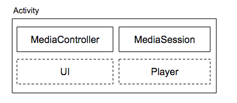

### 1. 背景

​		传统的媒体开发, 由我们自己定义接口, 服务端, 涉及到不同的业务往往需要重新定义不同的接口, 导致开发成本增加, 为此google在5.0中提供了一套多媒体开发框架, 目前Android9源码中蓝牙音乐服务/收音机服务等均已采用此架构. 主要目的为了规范媒体服务和客户端之间的通信接口, 实现解耦

### 2. 整体架构


​		UI和播放器针对不同项目可有不同程度的扩展, 但针对媒体应用来说, 业务交互基本相同, 所以抽出了MediaController和MediaSession实现核心交互逻辑

#### 2.1 核心类

* MediaController(媒体控制器)

  负责与UI的交互, 将用户的操作通过媒体控制器转换为对会话的回调, 同样, 媒体会话改变会通知控制器的回调变化, 实现双重更新机制

* MediaSession(媒体会话)

  负责与播放器的所有通信, 对UI隐藏播放器实现细节

  维护播放相关的信息, 比如播放状态, Id3info等

<!--more-->

<!--more-->

### 3. 使用媒体会话


```java
//1. 在Activity或服务的onCreate中初始化
mediaSession = new MediaSessionCompat(context, TAG);
mediaSession.setActive(true);

// Do not let MediaButtons restart the player when the app is not visible
mediaSession.setMediaButtonReceiver(null);
mediaSession.setFlags(
                MediaSessionCompat.FLAG_HANDLES_MEDIA_BUTTONS);

// 2. 初始化PlaybackStateCompat实例
stateBuilder = new PlaybackStateCompat.Builder()
      .setActions(
         PlaybackStateCompat.ACTION_PLAY |
         PlaybackStateCompat.ACTION_PLAY_PAUSE |
         PlaybackStateCompat.ACTION_FAST_FORWARD |
         PlaybackStateCompat.ACTION_REWIND |
         PlaybackStateCompat.ACTION_PAUSE);
mediaSession.setPlaybackState(stateBuilder.build());
// 3. 设置callback, 接收客户端传来的消息, 如播放暂停上下曲
mediaSession.setCallback(new MySessionCallback());

// 4. 媒体信息改变/播放状态改变
mediaSession.setMetaData();
mediaSession.setPlaybackState()
```


### 4. 构建视频应用

​		播放视频时, 依赖于界面, 设计结构如下:



使用步骤:

1. 在onCreate中初始化MediaSession

2. 设置回话回调

3. 初始化媒体控制器

   ```java
   // 1. Create a MediaSessionCompat
   mediaSession = new MediaSessionCompat(this, LOG_TAG);
   
   // Enable callbacks from MediaButtons and TransportControls
   mediaSession.setFlags(
       MediaSessionCompat.FLAG_HANDLES_MEDIA_BUTTONS |
       MediaSessionCompat.FLAG_HANDLES_TRANSPORT_CONTROLS);
   
   // Do not let MediaButtons restart the player when the app is not visible
   mediaSession.setMediaButtonReceiver(null);
   
   // Set an initial PlaybackState with ACTION_PLAY, so media buttons can start the player
   stateBuilder = new PlaybackStateCompat.Builder()
           .setActions(
            PlaybackStateCompat.ACTION_PLAY |
            PlaybackStateCompat.ACTION_PLAY_PAUSE);
   mediaSession.setState(stateBuilder.build());
   
   // 2. MySessionCallback has methods that handle callbacks from a media controller
   mediaSession.setCallback(new MySessionCallback());
   // 3. initial mediacontroller
   mediaController = new MediaControllerCompat(context, mediaSession);
   ```

   

### 5. 构建音频应用

​		构建音频应用时, 不依赖于界面, 界面销毁后依然能在后台播放, 设计架构如下:


* MediaBrowser

  用于连接音频服务, 实现多对一的架构

  **使用步骤**

  ```java
  mediaBrowser = new MediaBrowserCompat(context,
                  new ComponentName(ServicePackage, ServiceClass),
                  connectionCallbacks,
                  null); 
  mediaBrowser.connect();
  
  private final MediaBrowserCompat.ConnectionCallback connectionCallbacks = new MediaBrowserCompat.ConnectionCallback() {
          @Override
          public void onConnected() {
  			//拿到媒体控制器
              mediaController = new MediaControllerCompat(mContext, token);
          }
      //...省略其它
  }
  ```

  

* MediaBrowserService

  用于构建音频服务, 生命周期同正常的Service

  内部维护MediaSession和Player

  **使用步骤**

  1. 清单文件中

     ```xml
     <service android:name=".MediaPlaybackService">
           <intent-filter>
             <action android:name="android.media.browse.MediaBrowserService" />
           </intent-filter>
         </service>
         
     ```

  2. 服务继承MediaBrowserServiceCompat

  3. 初始化媒体会话(同第三节)

     

### 6. 响应媒体按钮

Android8.0之后


​		正常情况下触发方控按钮后会匹配到当前激活态的MediaSession, 并回调onMediaButtonEvent()方法, 默认解析常用的键值到对应的方法

| KEYCODE_MEDIA_PLAY |    onPlay()    |
| :----------------: | :------------: |
| KEYCODE_MEDIA_NEXT | onSkipToNext() |
|        ...         |      ...       |

​		如需自定义按钮实现可重写onMediaButtonEvent()

```java
@Override
public boolean onMediaButtonEvent(Intent mediaButtonEvent) {
    KeyEvent keyEvent = mediaButtonEvent.getParcelableExtra(Intent.EXTRA_KEY_EVENT);
}
```

​		**注意**: 

1. 根据实际应用中发现, MediaSession的查找并不完全根据active的状态, 而是根据setPlayState状态匹配底层实际播放器的状态决定的
2. Activity界面消费按键后, 不会走到MediaSession的查找逻辑

### 常见问题

#### Q1: 方控下一曲多次, 音源跑到上一个, 如当前播放视频, 切曲多次跑到了音乐源

​		A: 舒工(万里)查找源码后发现, MediaSession的遍历依赖当前uid, 车机应用中基本每个媒体服务都设置了android:sharedUserId="android.uid.system", 所以匹配不到对应的Session后, 会取列表中的第一个, 导致不匹配

解决方案有两种:

  1. 不设置system属性

     不设置此属性, 当前应用维护的MediaSession一般只有一个, 所以不会匹配错乱

     此方案需要动态申请权限

  2. 当前丢失焦点后或者确认不播放音乐的场景 MediaSession.setPlayState(null)

     此方案需要用到播放状态回调的地方判断null, 视为暂停状态

